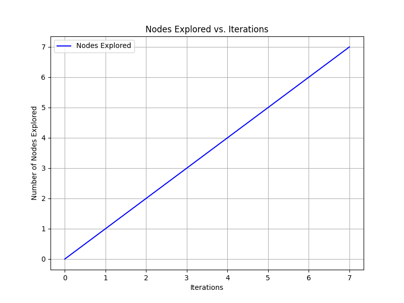

# N-Puzzle Game

## Overview

The N-Puzzle Game is a classic sliding puzzle implementation that supports various grid sizes (3x3, 4x4, 5x5) and multiple heuristic algorithms for solving the puzzle automatically. This project provides both a graphical interface (using PyQt5) and a robust puzzle-solving engine with different heuristic approaches.

## Features

### Core Functionality
- **Customizable Puzzle Sizes**: Play with 3x3, 4x4, or 5x5 grids
- **Interactive GUI**: Visual puzzle representation with tile movement
- **Automatic Solving**: AI solver using best-first search with selectable heuristics
- **Puzzle Generation**: Random shuffling to create new puzzles

### Heuristic Algorithms
1. **Misplaced Tiles**: Counts tiles not in their goal position
2. **Manhattan Distance**: Sum of distances each tile is from its goal position
3. **Linear Conflict**: Manhattan distance plus penalties for linear conflicts
4. **Nilsson's Sequence**: Special heuristic for 3x3 puzzles combining Manhattan distance with sequence scoring

### Technical Features
- State management with path reconstruction
- Search statistics tracking (nodes expanded, solution depth, etc.)
- Comprehensive unit testing

## Installation

### Prerequisites
- Python 3.7+
- pip package manager

### Steps
1. Clone the repository:
   ```bash
   git clone https://github.com/your-username/N-Puzzle-Game.git
   cd N-Puzzle-Game
   ```

2. Install dependencies:
   ```bash
   pip install -r requirements.txt
   ```

## Usage

### Running the Application
```bash
python main.py
```

### Game Interface
- **Grid Display**: Shows the current puzzle state
- **Size Dropdown**: Select puzzle size (3x3, 4x4, 5x5)
- **Heuristic Dropdown**: Choose solving algorithm
- **Shuffle Button**: Randomize the puzzle
- **Solve Button**: Automatically solve the puzzle
- **Status Label**: Shows game messages and solving progress


## Architecture

### Key Components

1. **PuzzleState (puzzle.py)**
   - Represents the puzzle state
   - Handles tile movements and valid move generation
   - Tracks parent states for path reconstruction
   - Includes shuffle functionality

2. **Heuristics (heuristics.py)**
   - Various heuristic functions for estimating solution cost
   - All functions take a PuzzleState and return an integer

3. **Search Algorithm (search.py)**
   - Best-first search implementation
   - Uses a priority queue based on heuristic values
   - Tracks search statistics

4. **GUI (main.py)**
   - PyQt5-based interface
   - Visualizes puzzle state
   - Provides controls for puzzle manipulation

## Testing

The project includes comprehensive unit tests:

```bash
python test_all.py
```

Tests cover:
- Puzzle state manipulation
- Heuristic calculations
- Search algorithm functionality

## Performance Considerations

- The search algorithm has a default node limit of 100,000 to prevent excessive resource usage
- Larger puzzle sizes (4x4, 5x5) may require more time/memory to solve
- Different heuristics have varying performance characteristics:
  - Manhattan Distance is generally fast and effective.
  - Linear Conflict can find better solutions but is more computationally expensive.
  - Nilsson's Sequence is specialized for 3x3 puzzles.
  - Misplaced Tiles is simple but less effective for larger puzzles.

## Collebrators and Team Members

1. **Mohammed Ibrahim**
2. **Sarah Sayed**
3. **Mahmoud Gamal**
4. **Doha Mostafa**
5. **Yehia Khalid**

## Diagrams

#### 1. Block Diagram

[](https://editor.plantuml.com/uml/XLF1JiCm3BrNwZyOSOOF618QJ0CE4ngC2veuHAdPhALEIPonxUjnMmQ5Rd2By-pdv-Ta6CK4IQNBivC2NuaH7iUZfwlxsyaOh3CnvbbS4LScc1AiBolFo3AJhKC8QCNmmc6UvTdy6gFSK8WoGnFiyWLE9xHOohLBYi-dWNmWsJuaJBZ7RWCYrs3QxHpEnCWNz8pE-NV5xZ05YaBs9h4LylnTRBQAZpULym6B6SeUcHAl5Advcigu1qPRmuUrdfrTmc-D0qWHu_7ihkW1-0g37YDuFbfoO9O1MEFSyIu_nbD5LL4tEPhUdLcflNEwezZt_xm_WFKiXZZM1h4NNMzj6VXNwFNACu01CGaPHpk4jvhqehaji0aWrhJjbLsYNS726zV6kAaC5r3wDKQzGJtN_NfT-swrTFe8aoOkz_1V7DqP3ufP83Tx-rzETnDDgGIZL6kA95Yq0_z9qDbDfvvzeO-czGIBLbHfDl1fezhxWpFFXXheX_q0)

#### 2. Flowchart Diagram

[](https://editor.plantuml.com/uml/ZLJ1JiCm3BrFsZ_ukFq24p040kqo8H1dL3KUZPGw9N7MZQ_7IRDs7KLmI_jU_9wVtQuz5uv3RUQpT9hFhZQaMHT6Vo4qJbkd-GYV0GD2gxa2tS4WTCRLc8-7nbY72Zpo1HJfshCklG1jfGt2udbSdYm3rWqVRvUWFIoEw9Vp6S3LMwD42-hYa9bUAguIz83vJNJJ6JIsHSzGON19i2Dkg7HO8x78AFJHQa4ALKBr3XQlgOBeVjZ2Y0Eka0OFWukev3ibRqrWRGaKDbojCky5EJZAZaIZkv5HpxQ99pHU0Y2RYvyPe3x52HDI_juIQmgO2ruK4iATKbcSRLzhTOAZqdQK0DnSnsZVKowJcfFDetGspZXJS_zRIp_RFuzWqhtSVqA6lIoDWjhkyVncNfj7wm2Biafujog41-uU1tOgHUYYRyAsNzW1JrcSaBH-VwNVpw1kWbpf-uUTU9eMoHFfmJYLyNTrIH-lAfGs48yu4htU3I_aCINJXph0_J4VJjIS-J_6-kiukp6kXIz_Zsy0)

#### 3. Class Diagram

[](https://editor.plantuml.com/uml/VP9DRi8m48NtaN87YrKGFmV80g6sGbrqqOhk4BA6P22M73krnmYeUlVQ9W5IK3UMF9vvxvkNp2s18LVBD2aaMClUtUaaSKb0oBxJXB492OasPs_2KhoNs52LCw7YTIGitscGsJ1d6wqbWehb7HBVWnGbh_KURNZk54QXaeN35s_yuXld5TYAyp0GBNxIvC9cX3Q2ZXyENKUdTDdHhJvT8t7bfyOi7ZVQwtLKhn2Qnjag2sF3QqatsGCMYUeHnXDQMWXZQObWYge5QLeu_XNeyZvixC138xN1CcTBF4VfmoSF_o8AkYp32-qKNVFTU3U-3NRSHhzCA44290_JsACUimgTyL68WczLpfv1IjX8Nw_XmDkelB1VwfnLRpPWhDjDVHEQBHJ8NZl5XLC52QtE-uvkdR9xb5vk_G-d9vCP6zIWZeD-v7-33Nr_OdpOyf_6T3gxNo5DvgXA_zV_0W00)

### 4. Plot Diagram

#### Overview
This feature visualizes the Best-First Search algorithm's progress by plotting the number of nodes explored over iterations.

#### What the Plot Shows
- **X-Axis**: Iterations (each step of the search).
- **Y-Axis**: Cumulative nodes explored.
- **Purpose**: Helps understand how quickly the algorithm explores states and the heuristic's impact.

#### How to Use
1. Run `main.py` to start the GUI.
   ```bash
   python main.py
   ```
2. Select puzzle size and heuristic from the dropdowns.
3. Click "Shuffle" to randomize the puzzle.
4. Click "Solve" to find a solution.
5. Click "Generate Plot" to create the plot, saved as `nodes_explored.png`.
6. Open `nodes_explored.png` to view the plot.

#### Example
The plot shows a line graph of nodes explored vs. iterations, varying by puzzle and heuristic.


